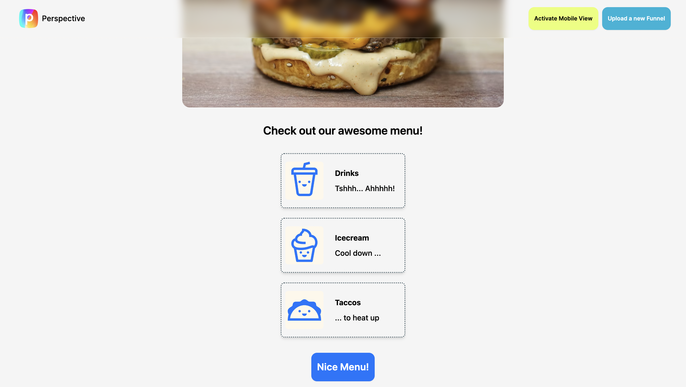
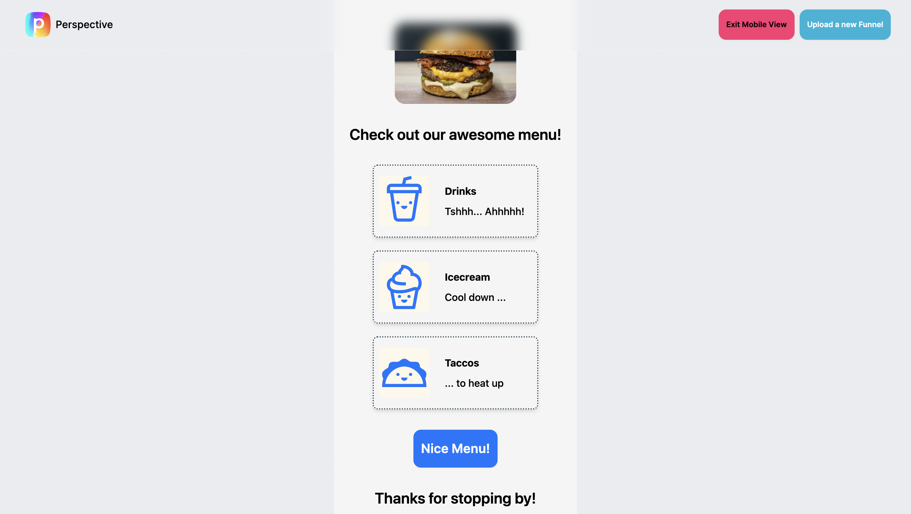

   
    
     
     
    <b>Work sample for Perspective.</b>
     
     
    <a href="https://ahmed-mouelhi-funnel-preview.vercel.app">➡️ https://ahmed-mouelhi-funnel-preview.vercel.app</a>

___

# 🐈  Hi @Perspective!

I had a lot of fun going through the work sample. As always, I always try to keep my apps code and architecture as simple and straightforward as possible;  **IIWYNI** (Implement It When You Need It 😉).

🏅 Implemented Must-Have Features.

- ✅ Upload a Funnel json file
- ✅ See all pages and blocks
- ✅ Change Funnel file and see UI displaying the new Funnel
- ✅ The app is hosted on Vercel

🎁 Implemented Must-Have Features.

- ✅ Mobile View Mode: Saves you the hastle to right click and inspect your browser, instead jus click on the feature button, and the UI will adapt itself. 🥰
- ✅ Basic file  schema validation upon uploading a file.

🧰 Tech used

* react
* vite
* typescript
* tailwindcss
* Zustand
* ua-parser-js

📈 The approach I used: 

1. setup app (vite, tailwind..)
2. Create preview component and style it. At this stage, the component displays a hard-coded funnel object. This decreases the scope and complexity. It allows me to focus on building a modular & reusable component. 
3. Create Funnel Picker Page and style it
4. Use the zustand libary to create a very minimal "navigation".
5. Add a "fancy" topbar, that gives the user the chance to change the active funnel with a newly uploaded file.
6. Created few reusable hooks.
7. Added the bonus feature 'MOBILE VIEW MODE‘
# 

   Looking forward to talk! 🚀

